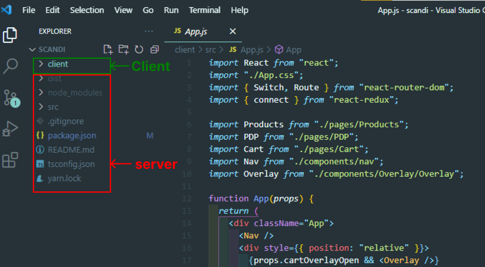
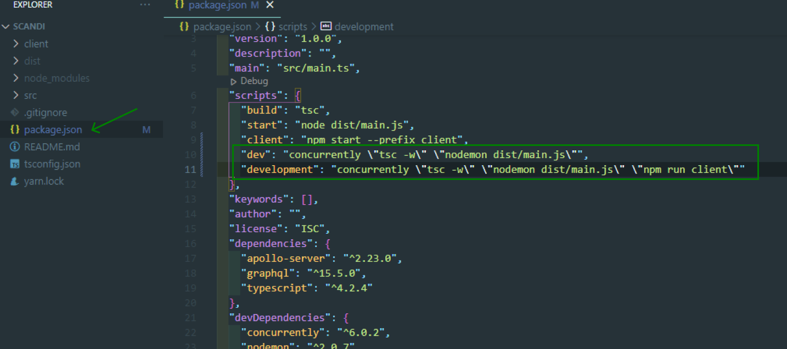
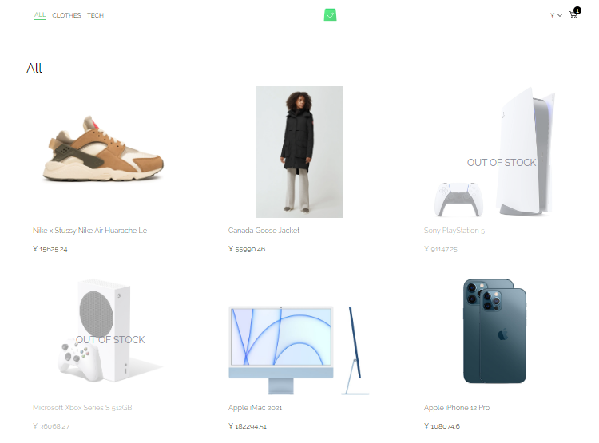

# Frontend React Minicart StoreFront

For this project to start you need to visit this link: https://github.com/scandiweb/junior-react-endpoint clone it, install dependencies and setup folder structure as shown below.

### Screenshot of My Folder Scructure

### How to run

To run this project follow these steps

1. Clone it
2. Install dependencies
3. Update your scripts on your backend's server package.json file to as below:

"scripts": {
"build": "tsc",
"start": "node dist/main.js",
"client": "npm start --prefix client",
"dev": "concurrently \"tsc -w\" \"nodemon dist/main.js\"",
"development": "concurrently \"tsc -w\" \"nodemon dist/main.js\" \"npm run client\""
}

### Screenshot of Server's Package.json file

4. From root run - `npm run development`

### Screenshot of project

